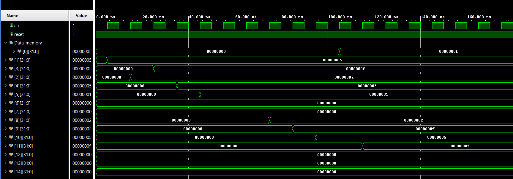

# Single-Cycle-Processor
This is a 32-bit processor design and is a reduced version of a RISC-V RV32I processor has been implemented using Verilog.  
The following type of instructions have been implemented - R-type, I-type, B-type, J-type, S-type.

A list of all the instructions implemented is as follows:  
R-Type: ADD,SUB,SLT,OR,AND  
I-Type: ADDI, SLT, ORI, ANDI  
LW(load word) - This is also an I-type instruction.  
S-Type: SW  
B-Type: BEQ, BNE  
J-Type: JAL  

To test the design, we take a test program which includes all the implemented instructions and convert it into its equivalent hex code and place it in the instruction memory.  
Here is the assembly program:  

addi x1,x0,5  
addi x2,x0,10  
add x3,x1,x2  
sub x4,x2,x1  
slt x5,x1,x2   
slti x6,x2,5   
and x7,x1,x2   
andi x8,x2,3  
or x9,x1,x2   
ori x10,x1,1    
sw x3,0(x0)   
lw x11,0(x0)  
beq x11,x3,+8  
addi x12,x0,1  
bne x1,x2,+8   
addi x13,x0,1  
jal x0,+8  
addi x14,x0,1   
addi x15,x0,7   

The above program should result in the following registers in the register file getting the following values:  
x1 ->               5   
x2 ->             10   
x3  ->             15  
x4   ->            5  
x5    ->           1  
x6->0  
x7  ->            0  
x8  ->         2  
x9    ->         15   
x10  ->       5   
x11   ->      15  
x12    ->      0  
x13   ->     0       
x14    ->       0       
x15   ->    7    

Also, the data memory location 0x100 should get the following value: 0x00000055

The wavform diagram of the register file after running the testbench is shown below:

